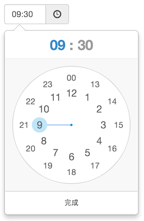

> 最近开发的一个模拟时钟的时间选择器 ClockPicker，用于 Bootstrap，或者单独作为一个 jQuery 插件。
>
> 源代码托管在 GitHub 上: [ClockPicker](https://github.com/weareoutman/clockpicker)

最近项目中需要用到一个时间选择器，之前用到的 [bootstrap-datetimepicker](http://www.malot.fr/bootstrap-datetimepicker/) 在选择日期时蛮好用，但是它的时间选择（时:分）却有点别扭，后来发现 Android 上调闹铃时的选择器挺不错，于是决定自己开发一个类似的模拟时钟的时间选择器。

最开始只是打算做一个用于 Bootstrap 的组件，后来发现我只是用了 Bootstrap 的 `.popover` 和一些 `.btn` 的样式，于是我将这些样式取出来，让它同时支持单独作为一个 jQuery 插件。

先看看截图，使用过 Android 手机的亲人们对此应该不陌生：



### Demo

http://weareoutman.github.io/clockpicker/

### 浏览器兼容性

支持所有主流浏览器，包括 IE 9+ 。理论上在 IE 8 下也能正常运行，除了没有圆角边框、指针效果外。不过我没有仔细测试它在 IE 8 下的表现。

如果你的项目必须兼容 IE 6/7 ，你可能得另辟蹊径！

### 设备兼容性

除了桌面设备外，它也能很好的支持移动设备。如果你使用触摸屏设备，你可以拖动指针转动。当然，桌面设备也可以按住鼠标进行拖动选择。

另外，如果你的手机支持，在点选或拖动指针时，会有力学反馈哦。这个细节也是模仿自手机上的体验。

### 使用

```html
<!-- Bootstrap stylesheet and scripts -->

<!-- ClockPicker Stylesheet and script -->
<link rel="stylesheet" type="text/css" href="dist/bootstrap-clockpicker.min.css">
<script type="text/javascript" src="dist/bootstrap-clockpicker.min.js"></script>

<!-- Input group, just add class 'clockpicker', and optional data-* -->
<div class="input-group clockpicker" data-placement="right" data-align="top" data-autoclose="true">
	<input type="text" class="form-control" value="09:32" />
	<span class="input-group-addon">
		<span class="glyphicon glyphicon-time"></span>
	</span>
</div>

<!-- Or just a input -->
<input id="demo-input" />

<script type="text/javascript">
$('.clockpicker').clockpicker()
	.find('input').change(function(){
		// TODO: time changed
		console.log(this.value);
	});

$('#demo-input').clockpicker({
	autoclose: true
});
</script>
```

对于非 Bootstrap 项目，直接使用 `jquery-*` 的文件（替换 `bootstrap-*` ）即可。

### 选项参数

| 名称 | 默认 | 说明 |
| ---- | ------- | ----------- |
| default | `''` | 默认时间，如 `'13:14'` |
| placement | `'bottom'` | 弹层位置 |
| align | `'left'` | 弹层箭头对齐 |
| donetext | `'完成'` | 完成按钮文字 |
| autoclose | `false` | 选定分钟后自动关闭 |
| vibrate | `true` | 拖动指针时小震一下手机 |

[ClockPicker: Fork me on GitHub](https://github.com/weareoutman/clockpicker)
