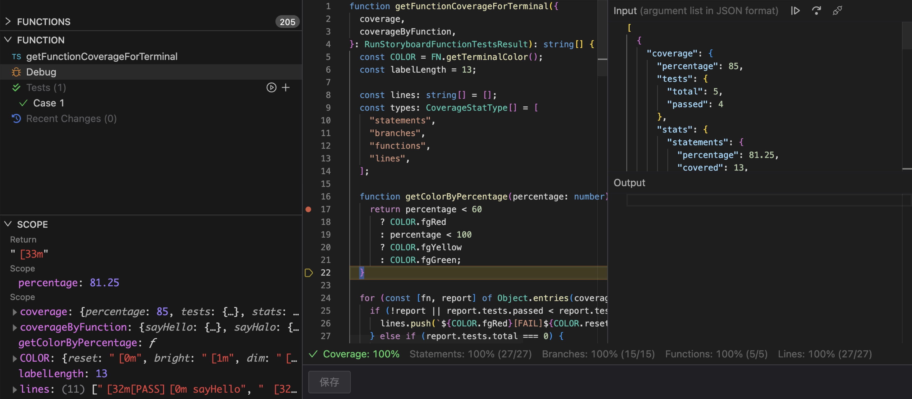

在某些项目中，特别是低代码平台、在线代码编辑器等，我们往往需要提供一个沙盒环境，让用户可以自行编写并运行 JavaScript 代码。这个沙盒需要提供一些平台内置 API 的访问，同时还需要限制用户代码的访问权限，以防止用户恶意操作。

如果不考虑安全性等因素，要在浏览器中使用 JavaScript 实现运行用户或者其他第三方编写的 JavaScript 代码并不难，只需要使用 `eval` 函数或者 `Function` 构造函数即可。但考虑下面的代码<sup>[\[1\]]</sup>：

```js
[].filter.constructor("alert('jailbreak')")()
```

这样的代码看上去人畜无害，没有直接访问任何全局对象，却可以让你的网页弹出一个恼人的对话框。事实上，攻击者可以只使用6种符号即可组合构造任意代码 <sup>[\[2\]]</sup>：`(`, `)`, `[`, `]`, `!` 和 `+`。

因此我们有必要构造一个沙盒环境，根据业务需求，限制用户代码对特定对象的访问，防止恶意操作。

既然是沙盒环境，我们还可以跳脱传统 JavaScript 的限制，扩展它的能力，例如：

- 支持最新的 ECMAScript 特性
- 支持 TypeScript
- 免编译执行

你没看错，我们可以在老旧浏览器中免编译执行包含最新特性的 JavaScript 甚至是 TypeScript。

除此之外，基本的开发体验也是必不可少的，包括：

- 单步/断点调试
- 统计测试覆盖率



<p className="figure-caption">优维低代码平台的函数调试界面</p>

## 理论

要实现一个沙盒环境，在一定程度上等同于实现一门编程语言，当然我们这里不需要重现设计一门新的编程语言，只需关注实现。

编程语言的实现一般包括三个阶段：

1. 词法分析（Lexical Analysis）
2. 语法分析（Syntax Analysis）
3. 语义分析（Semantic Analysis）

其实这个过程也适用于自然语言。例如，当我们阅读一篇文章时：

1. 我们首先识别出一个个的词语及符号，这是词法分析；
2. 然后识别语法，例如主/谓/宾，并组成特定的句子，这是语法分析；
3. 最后理解文章整体表达的思想，这是语义分析。

对于编程语言，词法分析将源代码分解为 tokens，语法分析将 tokens 组合成抽象语法树（Abstract Syntax Tree）。根据语义分析阶段的不同，可以将编程语言的实现分为解释型和编译型。它们的区别是，在得到抽象语法树后，解释型语言直接遍历并执行抽象语法树，而编译型语言将抽象语法树转换为机器码后再执行。

```
Source ──> Tokens ───> AST ───> Behavior
    (Lexer)    (Parser) │ (Interpreter)
                        │
             (Compiler) └─ ───> Machine Code
```

编译型语言的优势在于执行效率高，因为编译优化后得到的是机器码可以直接交给 CPU 执行；而解释型语言的优势在于开发效率高，同时可以支持运行时动态代码执行，因为它不需要额外的编译过程。通常支持 [`eval()`](https://developer.mozilla.org/en-US/docs/Web/JavaScript/Reference/Global_Objects/eval) 方法的编程语言都是解释型语言，例如 JavaScript / Python / PHP。

现代浏览器的 JavaScript 引擎通常已经不是纯粹的解释器，例如 Google V8 采用了 JIT（[Just-In-Time](https://zh.wikipedia.org/zh-cn/%E5%8D%B3%E6%97%B6%E7%BC%96%E8%AF%91)）编译器，它会在运行时阶段将解释执行的代码提前编译为*字节码*（注意它和*真编译型语言*转换的*机器码*有所不同）以提高执行效率。

我们这里的场景只能选择使用解释器。

## 实现

现在我们开始动手编码，JavaScript 的词法和语法分析已经非常成熟，比如我们可以直接使用 `@babel/parser`：

```js
import { parseExpression } from "@babel/parser";

export function parse(source) {
  // 为简单起见，这里只解析表达式
  return parseExpression(source, {
    // 使用 estree 格式的 AST https://github.com/estree/estree
    plugins: ["estree"],
  });
}
```

需要我们自己实现的主要是语义分析部分，即：如何遍历解释并执行抽象语法树。我们可以参考 [ECMAScript 官方规范](https://tc39.es/ecma262/)来实现，先假设我们仅支持 *Literal* 节点（字符串、数字、布尔等），这非常简单：

```js
export function interpret(ast) {
  function Evaluate(node) {
    switch (node.type) {
      case "Literal":
        return node.value;

      default:
        throw new TypeError(`Unsupported node type: ${node.type}`);
    }
  }

  return Evaluate(ast);
}
```

这样我们就可以解释并执行一个简单的表达式了：

```js
interpret(parse("42")); // 42
```

接来我们再支持下二元表达式 *BinaryExpression*：

```js
switch (node.type) {
  case "BinaryExpression": {
    // https://tc39.es/ecma262/#sec-evaluatestringornumericbinaryexpression
    const leftValue = Evaluate(node.left);
    const rightValue = Evaluate(node.right);
    const result = ApplyStringOrNumericBinaryOperator(
      leftValue,
      node.operator,
      rightValue
    );
    return result;
  }
  // case "Literal":
  // ...
}

function ApplyStringOrNumericBinaryOperator(leftValue, operator, rightValue) {
  switch (operator) {
    case "+":
      return leftValue + rightValue;
    case "-":
      return leftValue - rightValue;
    case "/":
      return leftValue / rightValue;
    case "*":
      return leftValue * rightValue;
  }
  throw new TypeError(`Unsupported binary operator \`${operator}\``);
}
```

现在我们已经可以进行四则运算了：

```js
interpret(parse("42 + 23")); // 65
interpret(parse("(42 + 23) / 5")); // 13
```

假设我们要为沙盒环境再提供一个内置 API `fibonacci(n)` 以获得第 n 个斐波那契数，为此我们需要支持 *CallExpression* 和 *Identifier*：

```js
switch (node.type) {
  case "CallExpression": {
    const func = Evaluate(node.callee);
    return EvaluateCall(func, node.arguments);
  }
  case "Identifier": {
    if (node.name === "fibonacci") {
      return function fibonacci(n) {
        return n <= 1 ? n : fibonacci(n-1) + fibonacci(n-2);
      };
    }
    throw new TypeError(`Unknown identifier: ${node.name}`);
  }
  // case "BinaryExpression":
  // ...
}

// https://tc39.es/ecma262/#sec-evaluatecall
function EvaluateCall(func, args) {
  const argList = ArgumentListEvaluation(args);
  const result = func.apply(null, argList);
  return result;
}

// https://tc39.es/ecma262/#sec-runtime-semantics-argumentlistevaluation
function ArgumentListEvaluation(args) {
  const array = [];
  for (const arg of args) {
    array.push(Evaluate(arg));
  }
  return array;
}
```

现在我们可以拿到指定的第 n 个斐波那契数：

```js
interpret(parse("fibonacci((42 + 23) / 5)")); // 233
```

继续遵循 [ECMA-262](https://tc39.es/ecma262/) 语言规范，我们可以按照实际需求，选择性地逐步实现更多的语法能力，本文不再赘述。

由于代码执行的每个环节都由我们控制，所以我们可以轻松地限制用户代码对特定对象的访问。

## 调试

前面提到，良好的开发体验也必不可少，其中最重要的首先是单步/断点调试。由于沙盒中代码的执行不再是浏览器直接执行的，因此无法使用浏览器的调试工具，需要我们自己实现。

断点调试本质上是中断代码的执行，但 JavaScript 是单线程的，看上去我们无法在应用层将一个同步的代码变成异步、可中断的代码，但实际上可以找到解决办法。

“中断代码的执行”正是[生成器函数](https://developer.mozilla.org/en-US/docs/Web/JavaScript/Reference/Statements/function*)做的事。日常开发中，很少有人会使用它，但它所支持的按需暂停和恢复执行的特性，恰好符合实现断点调试的需求。

```js
function* test() {
  console.log("Hello");
  yield;
  console.log("World");
}

const gen = test();
gen.next(); // hello
gen.next(); // world
```

同时，我们可以让代码在调试执行时，是异步、可中断的，而在正常执行时，依然是同步的。

在我们的解释器中，可以先将源代码构造为一个包含 `yield` 断点的生成器中间函数，普通调用时，使用 `unwind` 同步展开生成的迭代器，因此该代码依然是同步执行的，而在调试模式下，直接返回生成的迭代器，这样就可以实现断点调试了：

```js
function* intermediate_fn() {
  yield;
  return 42;
}

function normal_fn() {
  return unwind(intermediate_fn());
}

function debugger_fn() {
  return intermediate_fn();
}

function unwind(iterator) {
  while (true) {
    const { done, value } = iterator.next();
    if (done) {
      return value;
    }
  }
}
```

改造后的解释器代码大概如下：

```js
export function interpret(ast) {
  function* Evaluate(node) {
    yield; // 断点
    
    switch (node.type) {
      case "CallExpression": {
        // 代理 Evaluate 遍历所生成的迭代器
        const func = yield* Evaluate(node.callee);
        return yield* EvaluateCall(func, node.arguments);
      }
      // ...
    }
  }
  // ...
}
```

调试器的启动和步进的实现就很简单了：

```js
let iterator;

const start = (code) => {
  iterator = interpret(parse(code));
}

const step = () => {
  iterator.next();
}
```

当然，这只是一个简单的实现，实际上，调试器还需要支持更多的功能，包括查看当前执行的代码位置、变量值、标记断点等等，本文不再细述。

## 覆盖率

另外，统计测试覆盖率也是一个非常重要的开发体验，是提高代码质量的主要手段。测试覆盖率主要考虑三个维度：

- 函数覆盖率：代码中的函数是否都被调用过？
- 语句覆盖率：代码中的语句是否都被执行过？
- 分支覆盖率：代码中的分支是否都被覆盖过？

传统的测试覆盖率统计工具，通常是通过在代码中插入计数器，记录每个代码块被执行的次数，最后生成报告。它本质上是改变了实际执行的代码，例如被 Jest 等测试工具集成的 [istanbul](https://istanbul.js.org/) ，在执行时会将以下源代码：

```js
function test(input = 0) {  
  if (input) {
    return true;
  }
  return input ? 1 : 0;
}
```

转换为：

```js
function test(
  input = (cov_159mw6va2c().b[0][0]++, 0)  
) {
  cov_159mw6va2c().f[0]++;
  cov_159mw6va2c().s[0]++;
  if (input) {
    cov_159mw6va2c().b[1][0]++;
    cov_159mw6va2c().s[1]++;
    return true;
  } else {
    cov_159mw6va2c().b[1][1]++;
  }
  cov_159mw6va2c().s[2]++;
  return input
    ? (cov_159mw6va2c().b[2][0]++, 1)
    : (cov_159mw6va2c().b[2][1]++, 0);
}
```

而由于我们的解释器是自己实现的，实现测试覆盖率的统计更为简单，只需要在遍历抽象语法树时，加入钩子即可：

```js
const shouldCover = [];
const covered = [];

const ast = parse(source); 

walk(ast, {
  hooks: {
    beforeVisit(node) {
      shouldCover.push(node);
    }
  }
});

for (const test of testCases) {
  const func = intercept(ast, {
    hooks: {
      beforeEvaluate(node) {
        covered.push(node);
      }
    }
  });
  func.apply(null, test.input);
}

const coverage = collect(shouldCover, covered);
```

<hr class="divider" />

好了，现在我们已经掌握了基本的方法去实现一个 JavaScript 沙盒，并支持单步/断点调试，以及统计测试覆盖率，有兴趣的同学可以在线体验一下这个 [Demo](https://codesandbox.io/p/sandbox/tiny-js-sandbox-app-f2dn8z?file=%2Fsrc%2Fcook.js)，并试着改进其中的解释器。

[\[1\]]: https://github.com/nyariv/SandboxJS
[\[2\]]: https://jsfuck.com/
