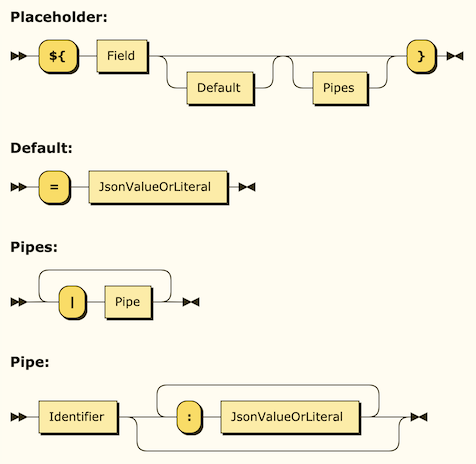
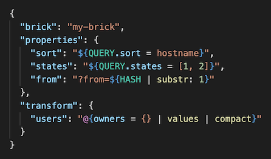
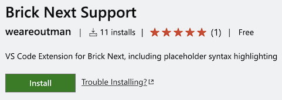

在工作中的一个项目里，我们为静态声明式的配置文件（JSON）添加了一个在运行时处理动态数据的能力。

我们尝试在 JSON 的字符串中扩展了类似 JS 的[模板字符串]能力，配置形式大约如下：

```json
{
  "brick": "my-brick",
  "properties": {
    "sort": "${QUERY.sort = hostname}",
    "states": "${QUERY.states = [1, 2]}",
    "from": "?from=${HASH | substr: 1}"
  },
  "transform": {
    "users": "@{owners = {} | values | compact}"
  }
}
```

其中被 `${...}` 包裹嵌入的表达式将在运行时被解析，并根据上下文信息计算得到最终的结果。开发者可以在这个表达式中填入使用的数据字段，指定当原始数据为空时应使用的默认值，设置管道和可选参数对数据进行加工，并且允许给默认值、参数等设置数组或字典这样的复合数据结构。

由于数组或字典这样的表达式内部包含了括号平衡，要解析这个嵌入式语法超出了传统的正则表达式的能力范畴，因此我们有必要为它设计一套严瑾的语法。

为了能方便地编译这套语法，它应该是[上下文无关]的，因此我们使用 [EBNF] 设计我们的语法如下：

```ebnf
InjectableString
         ::= ( Placeholder | RawString )*

Placeholder
         ::= '${' Field Default? Pipes? '}'

Default  ::= '=' JsonValueOrLiteral

Pipes    ::= ( '|' Pipe )+

Pipe     ::= Identifier ( ':' JsonValueOrLiteral )*

JsonValueOrLiteral
         ::= JsonValue | Literal
```

通过一个在线工具 [Railroad Diagram Generator] 可以将语法的结构可视化出来：



语法设计好了，接下来就可以实现它的编译器了，参考教程 *[Compiler Design Tutorial]* 依次实现[词法分析]和[语法分析]。具体的方案这里不再赘述，无外乎通过正则匹配取得 *Token* 列表，然后使用[自动机]分析生成语法树，最后系统根据语法树运行代码。

这套语法虽然看上去非常简单，但它已经能满足当下的需求，开发者理解来也并不费力。不过有一个缺点是这些嵌入的表达式无法被 IDE 识别并进行语法高亮，它们只是一串字符串。

众所周知，代码语法高亮是程序开发的基本要求，在*马斯洛需求层次理论*中属于最基本的*生理需求*。好在以 VS Code 为首的现代代码编辑器的优秀的可扩展能力，我们完全可以为这套刚出炉的语法实现一个语法高亮扩展。

> 关于如何开始编写 VS Code 扩展请参考[官方文档]。始终优先考虑第一手资料，我这里的或者别人的二手资料随时可能过时。

根据科学而详尽的官方文档指引，新扩展的编写按部就班：

1. [使用脚手架工具新建项目](https://code.visualstudio.com/api/get-started/your-first-extension)；
2. 根据[语法高亮指引]，这套新语法适用于 [Injection Grammars]；
4. 将新语法改写成 VS Code 使用的 [TextMate Grammars]；
5. 本地调试，最后完成[发布]。

其中没有太多的困难，主要的工作集中在编写 TextMate Grammars 上，但好在我们遵循了相对标准的设计，可以轻松地利用之前生成的语法设计图、词法和语法分析代码转换成 TextMate Grammars。

在这个扩展的加持下，我们的嵌入式代码终于变得灵动起来。



<hr class="divider" />

[Brick Next Support] 发布一天，喜获一条五星好评和十一次下载 👏。



[模板字符串]: https://developer.mozilla.org/en-US/docs/Web/JavaScript/Reference/Template_literals
[上下文无关]: https://en.wikipedia.org/wiki/Context-free_grammar
[EBNF]: https://en.wikipedia.org/wiki/EBNF
[Railroad Diagram Generator]: https://www.bottlecaps.de/rr/ui
[Compiler Design Tutorial]: https://www.tutorialspoint.com/compiler_design/index.htm
[词法分析]: https://www.tutorialspoint.com/compiler_design/compiler_design_lexical_analysis.htm
[语法分析]: https://www.tutorialspoint.com/compiler_design/compiler_design_syntax_analysis.htm
[自动机]: https://en.wikipedia.org/wiki/Automata_theory
[官方文档]: https://code.visualstudio.com/api
[语法高亮指引]: https://code.visualstudio.com/api/language-extensions/syntax-highlight-guide
[Injection Grammars]: https://code.visualstudio.com/api/language-extensions/syntax-highlight-guide#injection-grammars
[TextMate Grammars]: https://macromates.com/manual/en/language_grammars
[发布]: https://code.visualstudio.com/api/working-with-extensions/publishing-extension
[Brick Next Support]: https://marketplace.visualstudio.com/items?itemName=weareoutman.vscode-brick-next
