> 从太空俯瞰地球，有一块砖红色的大陆特别醒目，像一颗瑰丽的宝石镶嵌在我们的蓝色星球上。

突然有了兴致整理一下澳大利亚之行的文字。跳过瑰丽多彩的大堡礁珊瑚海，略过婀娜多姿的悉尼歌剧院，我们直接去往“世界的尽头”塔斯马尼亚，接着深入红色大陆的腹地北领地，最后达到“世界的中心”乌鲁鲁。

从墨尔本出发乘坐 Spirit of Tasmania 号渡轮，历经一晚共九个小时的航行就能到达澳大利亚的最南端塔斯马尼亚岛，从这里再往南，只剩下无尽的大海，说这里是世界的尽头也不为过。

在澳大利亚见到最多的不是袋鼠，也不是考拉，而是无处不在的桉树，无论走到哪里，一路上都有它们的陪伴。

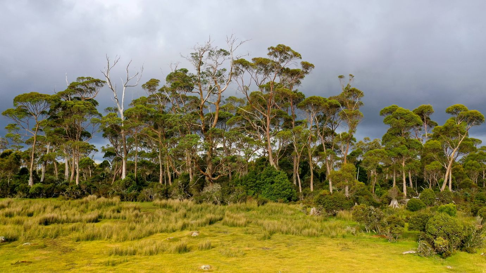

塔斯马尼亚的桉树林

澳大利亚贫瘠的土地孕育了这些生命力顽强的桉树，又或许是这些桉树塑造了现在的澳大利亚。

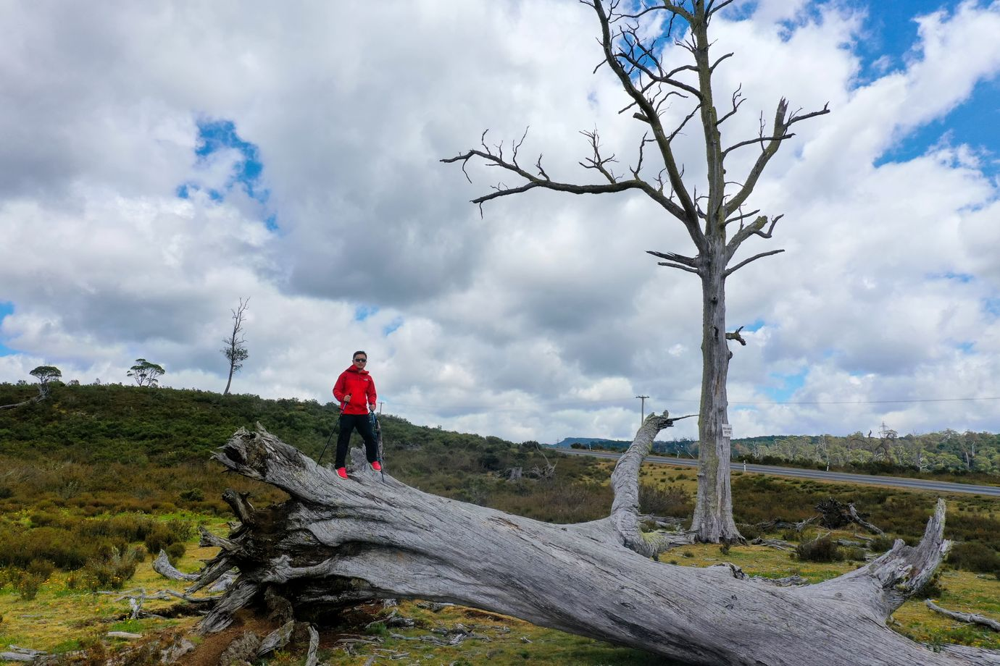

头顶是蓝天白云，脚下是枯藤老树

即使是这些看似枯死的桉树，也许下一个雨季就重新枝繁叶茂。

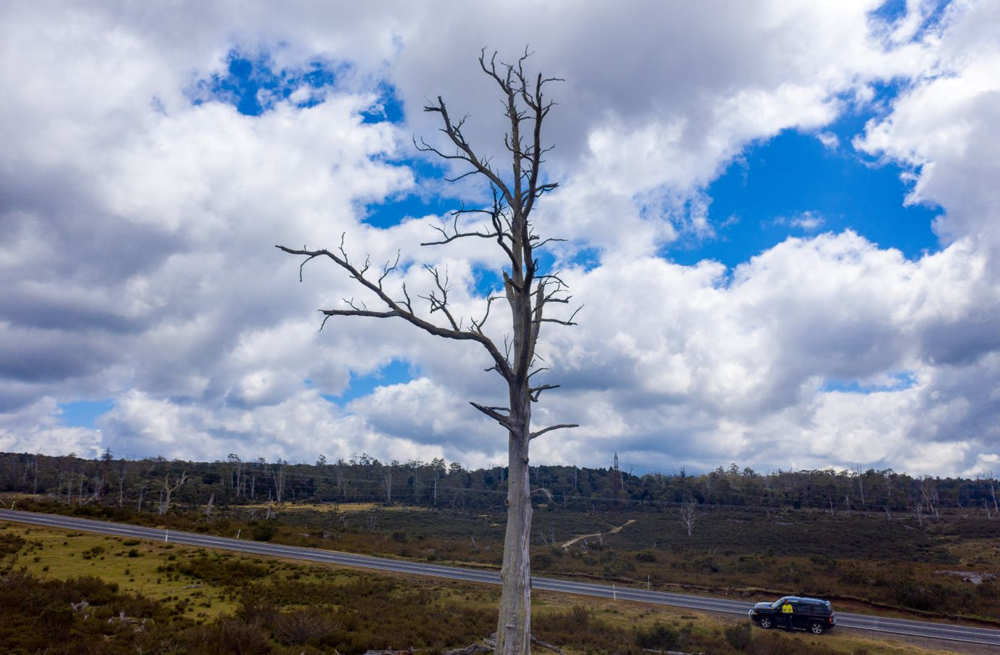

干枯的桉树

在塔斯马尼亚最南端的 Bruny Island，我们沿着一条不知名的小道步行，遇见了一群在一块大礁石上栖息的鸟群，腹部白色、背部黑色，憨态可掬，远远望去像极了企鹅。我们一度以为这是幸运的意外收获，后来放大照片再搜索查证才知道这只是澳洲一种特有的海鸟-黑面鸬鹚。

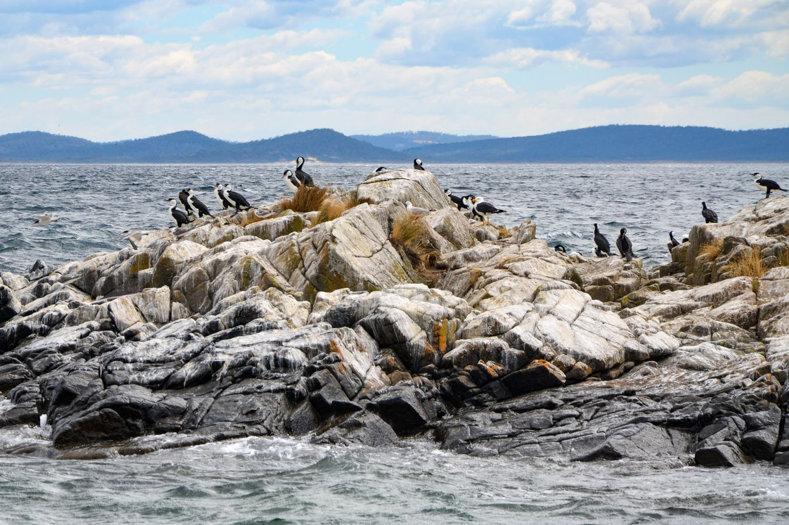

黑面鸬鹚 - by DN

摇篮山 Cradle Mountain 是岛上的最高峰，这里有几条热门的多日徒步路线。我们原计划在这儿露营一晚，但由于制定行程时过于匆忙，也没有留意到夏季这里的露营地需要提前数月预约，并且名额稀少，计划落空。但是在这片鲜有人迹的青山绿水之间走上一遭，也十分惬意，途中偶遇的澳洲针鼹、蓝舌蜥蜴、黑噪钟鹊是其中小小的惊喜。

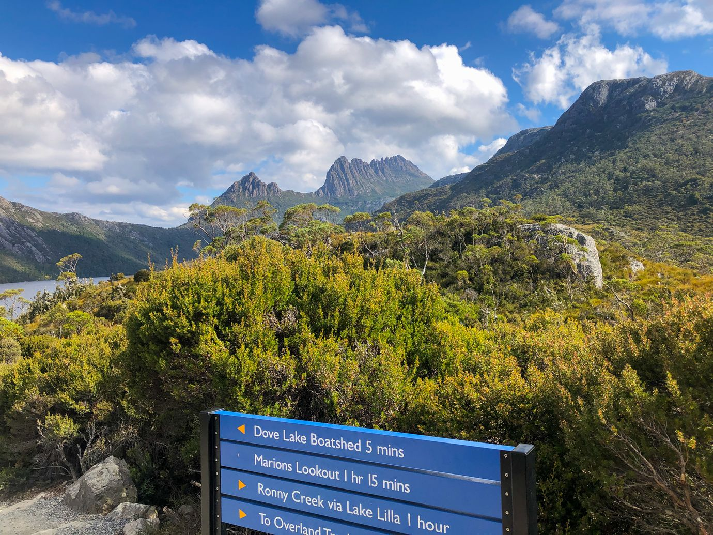

Cradle Mountain

乘渡轮回到墨尔本，来不及洗去身体的疲惫，我们沐浴朝霞、伴着初升的红日继续出发了，距离“世界的中心”还有两千多公里。

在南澳首府 Adelaide 稍作歇息，酒足饭饱一顿，接下来一路上与我们相伴的将只有红色的砂土、低矮的桉树、零星的灌木，以及公路边干瘪的袋鼠尸体。

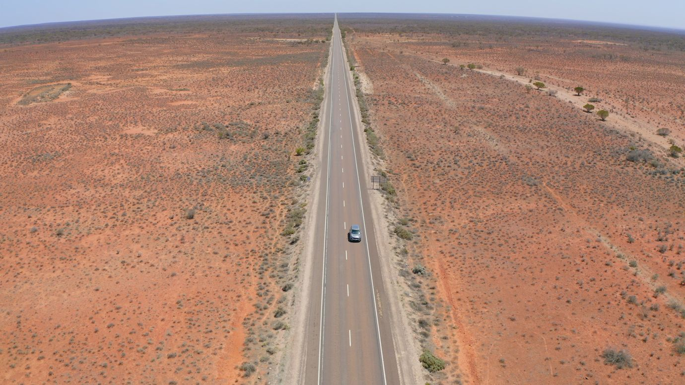

Stuart Hwy

Adelaide 以北 850 公里，Coober Pedy 地处南澳腹地，正好位于阿德莱德和爱丽丝泉的中间，这个荒漠中的小镇有它独特的魅力。

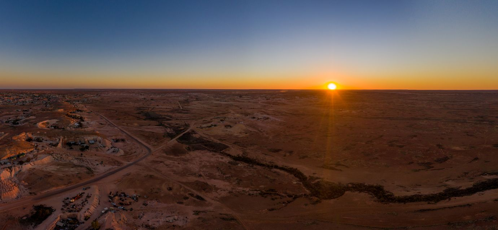

Coober Pedy 的日落全景

在炎热干燥的澳大利亚内陆，人类要想长期居住，必须适应这里恶劣的沙漠气候，也许是从咱们黄土高原上的窑洞那里获得了灵感，这里开始流行名为 “Dugout” 的地下洞穴房屋，它为人们提供了冬暖夏凉的居所。在小镇的外围遍布这样的洞穴民宿，表面上它们其貌不扬，内里却是温馨舒适、华丽而不张扬，同时又不失现代化的家居设施。路过这里的朋友一定不要错过这样别致的体验，记得挑选 AirBnb 上的 SuperHost。

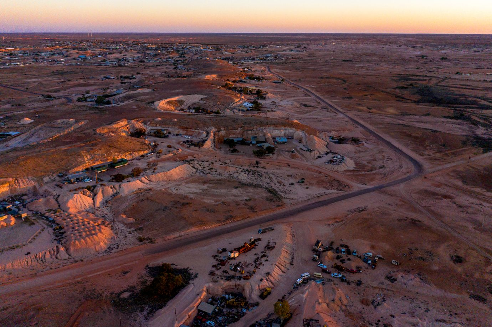

Coober Pedy 遍布的洞穴房屋

澳大利亚又名“坐在矿车上的国度”，而这个小镇正是世界上最大的蛋白石出产地，被称作“opal capital of the world”（上图下方还可以看见一些废弃的矿车）。

从 Coober Pedy 继续向北 400 公里，我们将跨过一个界碑，到达另一片神秘的土地-北领地。142 万平方公里的土地上，人口密度仅有 0.18 人/平方公里，连西藏的十分之一都不到。二十五万人口中，有 30% 的原住民，是澳大利亚原住民占比最多的州。

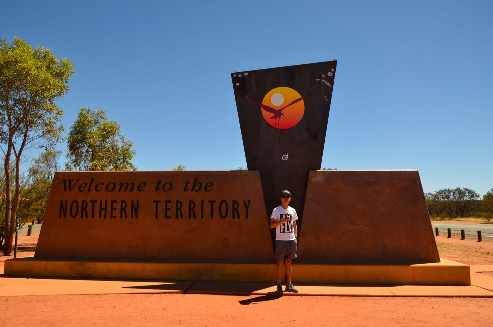

北领地/南澳界碑 - by DN

进入北领地后继续行驶 360 公里，我们终于到达世界的中心，眼前就是矗立在广袤红土荒原上的神秘红色巨石 - Uluru。这块巨石高出地面三百余米，周长近十公里，是世界上最大的单体岩石。它地处澳大利亚的地理中心，在这片荒漠的中央已经屹立了上亿年，它是一座超越时间长河的纪念碑，在日落的余晖中散发着令人沉醉的光泽。它有太多的神秘色彩，人们只能遐想造物者开天辟地时的鬼斧神工。

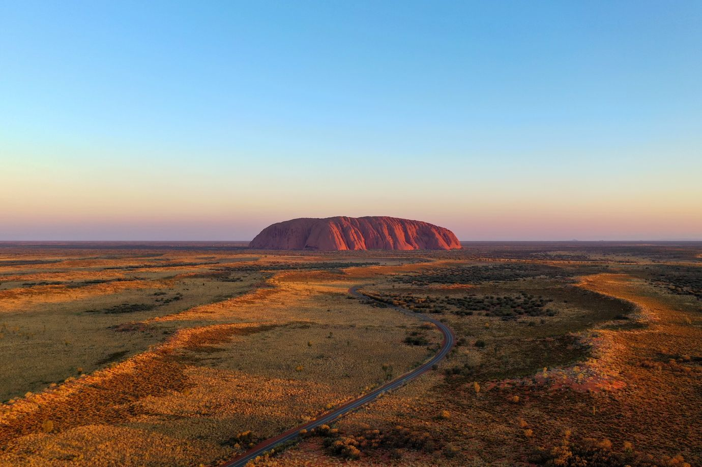

Uluru 黄昏

我们裹上魔术头巾、带上墨镜，这可不是为了营造一种荒野镖客的气场，而是为了抵御这里漫天乱窜、萦绕眼前的苍蝇，它们不招即来，挥之不去。

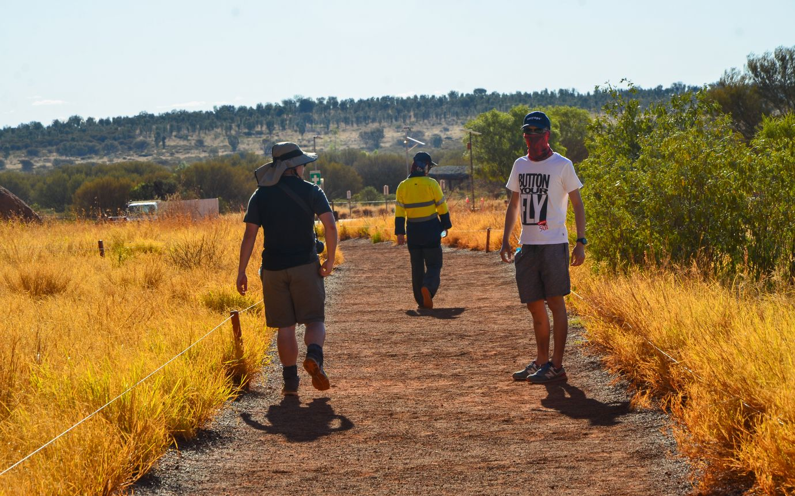

Uluru 荒野镖客 - by DN

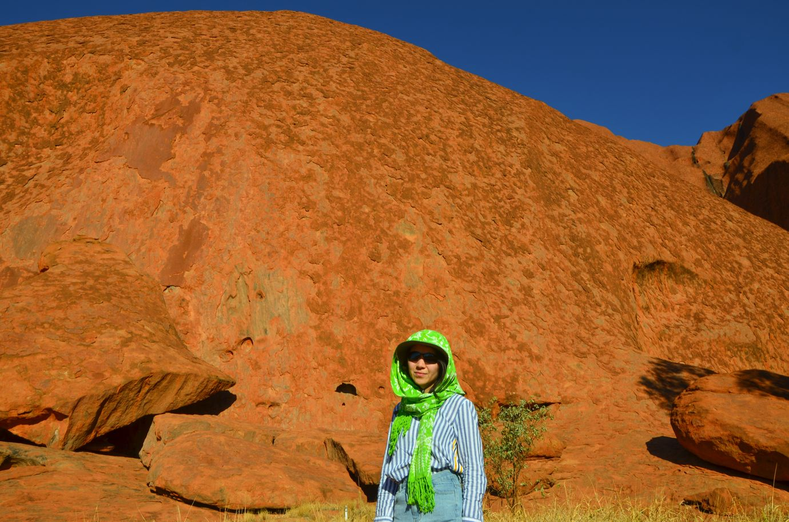

绿头巾的小姐姐

离开 Uluru，车窗外是金色的阳光。

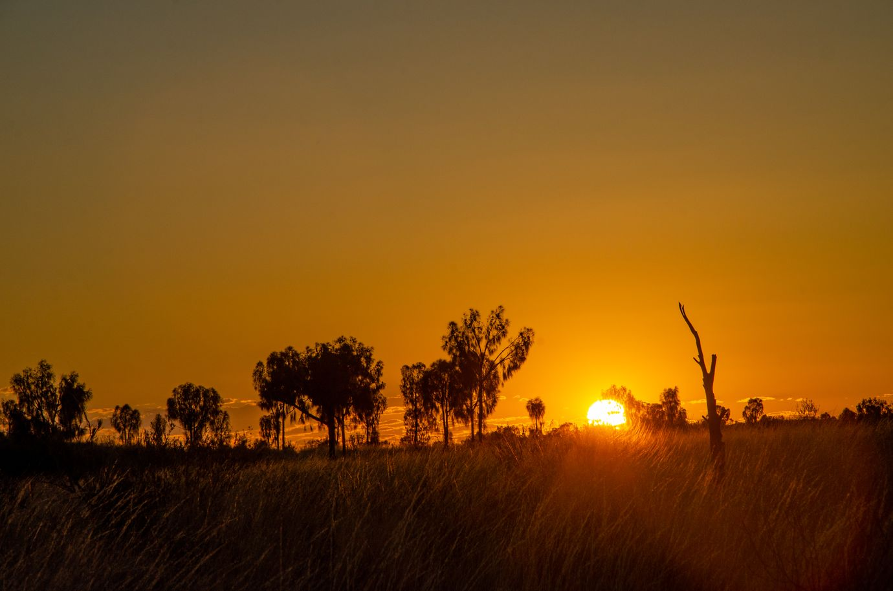

Uluru 附近的日落 - by DN

太阳已经落下，在这方圆百里可能都不见人类踪迹的夜路上开车，需要十分小心，如果迎面撞上一头一米多高的红大袋鼠可不是什么趣事，它们喜欢在凉爽的夜晚活动。

到了爱丽丝泉 Alice Springs，作为北领地的第二大城镇，它的常住人口却只有两万多，其中大约五分之一为原住民。

越来越多的原住民选择来到城镇或城镇近郊生活，在爱丽丝泉的街道上，可以看到很多光着脚丫的原住民，大部分人看上去比较友善，令人诧异的是好些原住民的身材都臃肿不堪，他们经常出入 KFC 等油炸食物店，可能跟这有关。

虽然澳大利亚政府在十年前已就“被偷走的一代”做出正式道歉，但原住民的生活条件、教育、医疗等资源依旧没有明显的改善，这导致爱丽丝泉的犯罪率一直颇高，还有“murder capital”之称。如果来到这里，傍晚之后尽量不要单独出行。

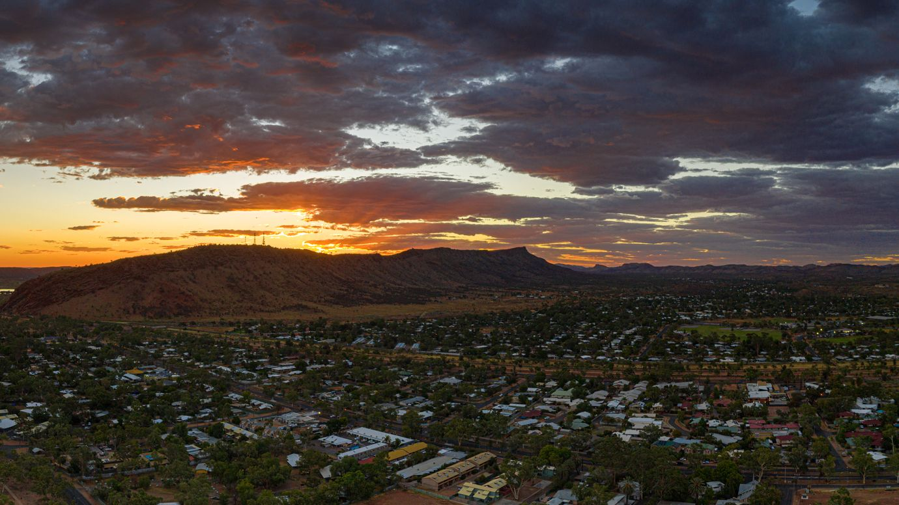

Alice Springs 日落全景

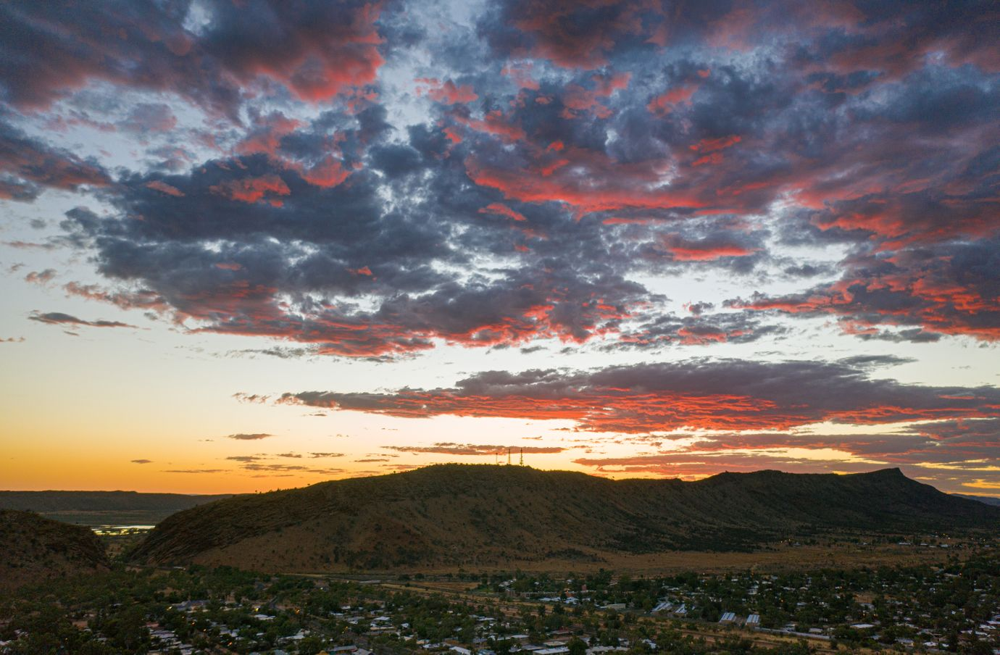

Alice Springs 晚霞

## 花絮

进入北领地之后不久，我们的座驾就出了故障，发动机故障灯亮起，无法加速到 60 公里以上的时速，空调也不再制冷。这辆车是正在 working holiday、自称“澳洲大 Labor”的 WY 买的二手 Jeep，在这前不着村，后不着店的荒漠里，这点问题倒也没有吓退两位汽车工程师出身的 WY 和 LC，一路慢慢摇到公路旅馆，在一顿谷歌之后一拍脑袋：“是节气门的问题！”说罢就打开引擎盖开始修（拆）车。

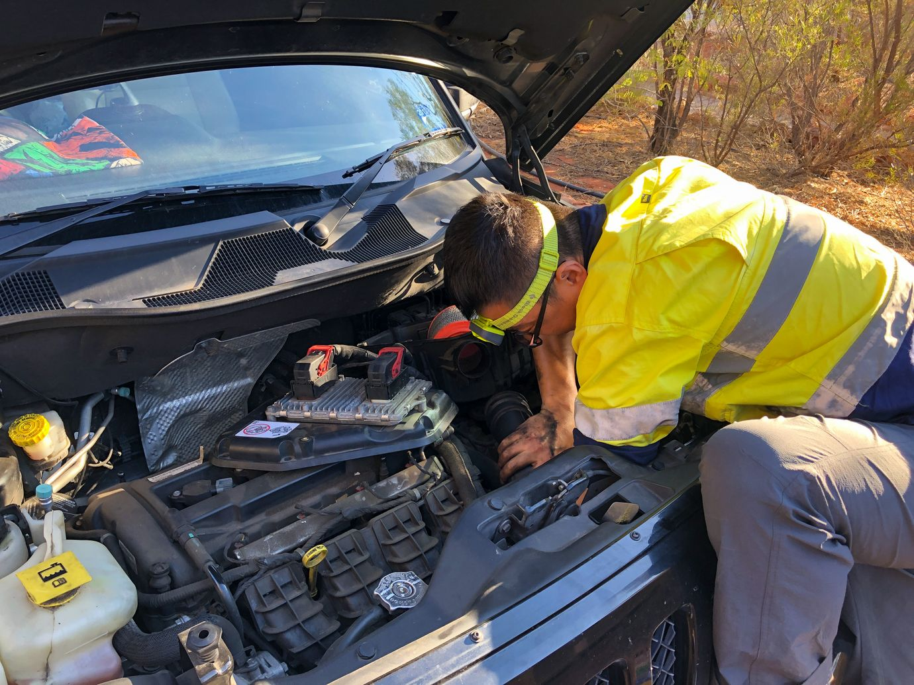

澳洲大 Labor

一波猛如虎的操作后，不愧是汽车工程师，虽然故障没修好，但好歹把各个零部件都给装回去了，第二天还能以之前的故障模式行驶。最近的可以修车的地方在两百公里以外的爱丽丝泉，一行四人只能以龟速行驶在气温接近 40℃ 的荒漠里，没有空调，车内体感温度可能接近 50℃。这样熬过了一两个小时，在即将中暑的边缘赶到了最近的休息点，买了一大袋冰块，在这袋冰块的支撑下最终活着赶到了爱丽丝泉。

而在这个人口稀少的小镇，要修理这辆二手 Jeep 也不是容易的事。在被几家修车店拒绝：“F**king Jeeps”之后，最后终于找到了一个印度工程师开的修车店愿意修理，但是零配件仍需要从外地配送，需要两三天的时间。原计划六千公里的 road trip，最后两千公里不得不改为飞机，而 WY 只能待在小镇等汽车修好后独自开回墨尔本。

飞回墨尔本后的第二天傍晚，我们见证了澳洲大 labor 的生猛，WY 打来电话说快到墨尔本了，这家伙连夜 26 小时、没有睡觉、独自开车 2300 公里，从爱丽丝泉赶到了墨尔本！

## 其它

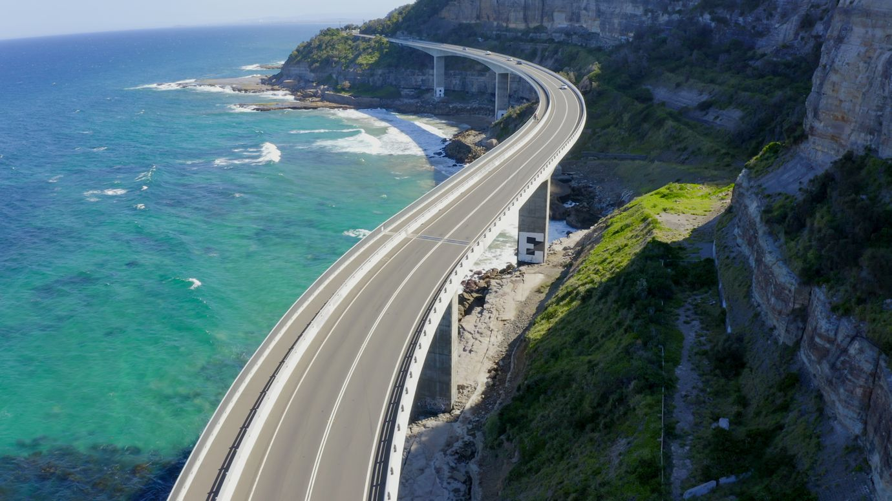

Wollongong 附近的 Sea Cliff Bridge

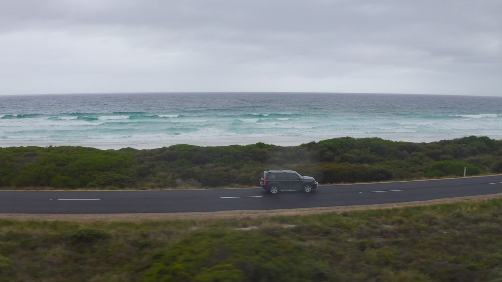

塔岛上的火焰湾附近

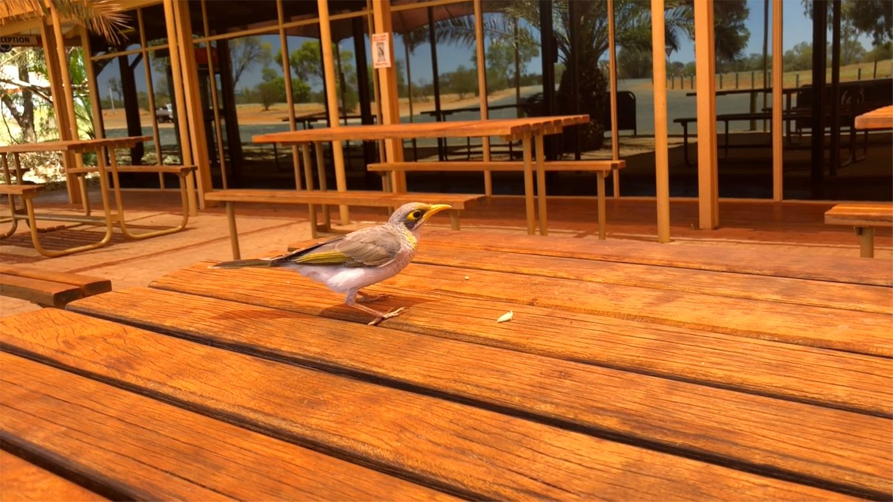

北领地的黄喉矿工 Yellow-throated Miner

最后附上澳洲行的视频连接《[从世界尽头到世界中心](https://www.skypixel.com/videos/fd1b2de3-3484-41a8-aff4-27a70c007bac?utm_source=copied&utm_medium=PCWeb&utm_campaign=share&sp=0)》。
