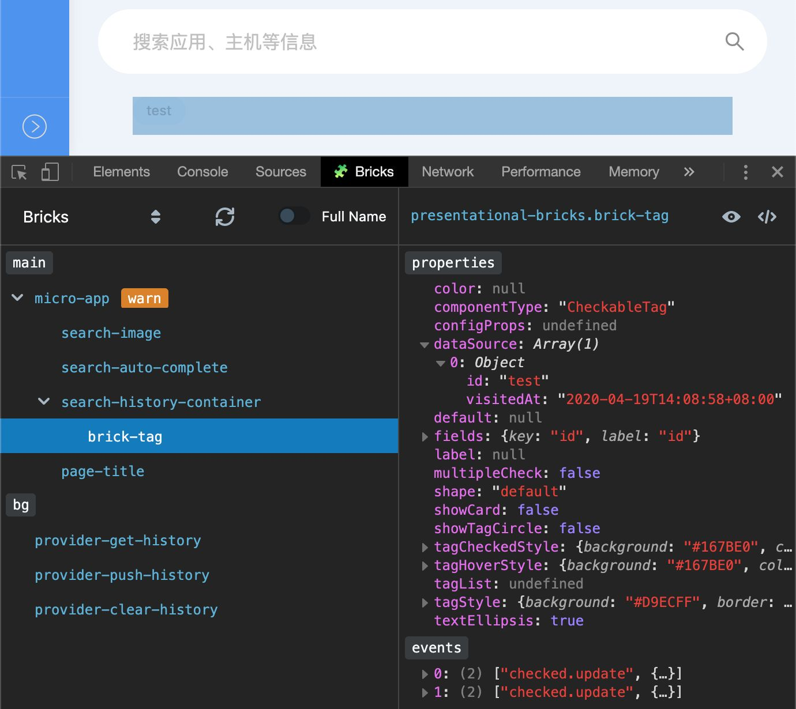
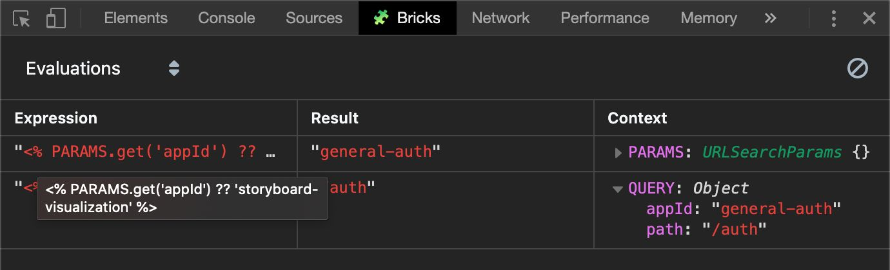
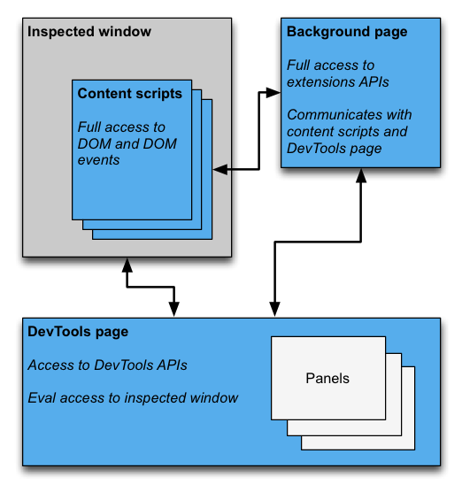

在工作中的一个项目里，我们的前端框架建立在 [Web Components] 技术之上，每个界面都由数个到数十个 [Custom Elements] 组成。它们基于 Web 标准技术，因此开发者可以直接使用浏览器原生的开发者工具来辅助开发和调试。例如利用 Chrome 的开发者工具，我们可以直接审查指定的 Custom Elements，也可以在控制台中打印出它们的属性等等。

这些自定义元素通常都有与业务相关的自定义属性、方法和事件，虽然我们可以在控制台中打印出这个元素，但是要从大量的继承自 `HTMLElement` 的属性中分辨出想要的业务属性并不容易。另一方面，框架为静态声明式的配置文件添加了运行时处理动态数据的能力，开发者有时希望能审查这些数据转换的过程。

浏览器原生的开发者工具已经不能满足我们的需求，因此我们决定扩展一下它的能力。

在讲述如何编写这个扩展前，先放一张成品图片，以便理解我们想要拓展的能力：

我们为开发者工具新建了一个 *“Bricks”* 的面板，它可以列出当前调试页面中的自定义元素列表，鼠标经过时可以实时显示对应元素的轮廓，点击选中一个元素则可以显示它的业务属性和事件配置等。切换到 *“Evaluations”* 则可以实时显示框架中被称为 *“Evaluate”* 的数据处理的过程、结果及其上下文信息。

接下来进入正题，首先阅读相关的官方文档《[Extending DevTools]》。

> 作者假设你已经有了*编写浏览器普通扩展的基础知识*，如果没有，请先参考[官方入门教程]。

下面这张图很好地解释了一个开发者工具的扩展所涉及的几个主要对象及其之间的关系：

- *Inspected window*: 当前审查的浏览器窗口。
- *Content scripts*: 内容脚本，可以访问 DOM 接口。
- *Background page*: 后台页面，可以访问完整的扩展 API；可以分别与 Content scripts、 DevTools page 通信。
- *DevTools page*: 开发者工具页面，可以访问开发者工具 API；可以对 Inspected window 执行 *Eval* 接口；还可以创建开发者工具面板（多个）。

[Web Components]: https://developer.mozilla.org/en-US/docs/Web/Web_Components
[Custom Elements]: https://developer.mozilla.org/en-US/docs/Web/Web_Components/Using_custom_elements
[官方入门教程]: https://developer.chrome.com/extensions
[Extending DevTools]: https://developer.chrome.com/extensions/devtools
[React Developer Tools]: https://chrome.google.com/webstore/detail/react-developer-tools/fmkadmapgofadopljbjfkapdkoienihi
