> 在太平洋的深处，有一片土地，它和最近的陆地相隔两åƒå…¬é‡Œï¼Œä»æ龙时代开始，八åƒä¸‡å¹´æ¥å®ƒä¸ä¸–éš”ç»ï¼Œç›´åˆ°ä¸ƒç™¾å¤šå¹´å‰ï¼Œæ‰ç¬¬ä¸€æ¬¡æœ‰äººç±»æ¶‰è¶³ï¼Œè€Œå®é™…上人类是站在这片土地上的第一ç§å¤§å‹é™†åœ°å“ºä¹³åŠ¨ç‰©ã€‚

这个å°å‡æœŸç»ˆäºå¾—闲写一点新西兰之行的文字，翻看ç€ç…§ç‰‡å’Œè§†é¢‘，有一个è¯å½¢å®¹æ–°è¥¿å…°å†å¥½ä¸è¿‡â€Šâ€” 纯净，纯净的土地ã€çº¯å‡€çš„æ°´ã€çº¯å‡€çš„天。

纵贯新西兰å—岛的 Southern Alps 高山上的冰å·è水，夹带ç€ç‰¹æœ‰çš„矿物质，让这里的湖泊呈ç°å‡ºç»¿æ¾çŸ³èˆ¬çš„æ¹›è“，令人沉醉。

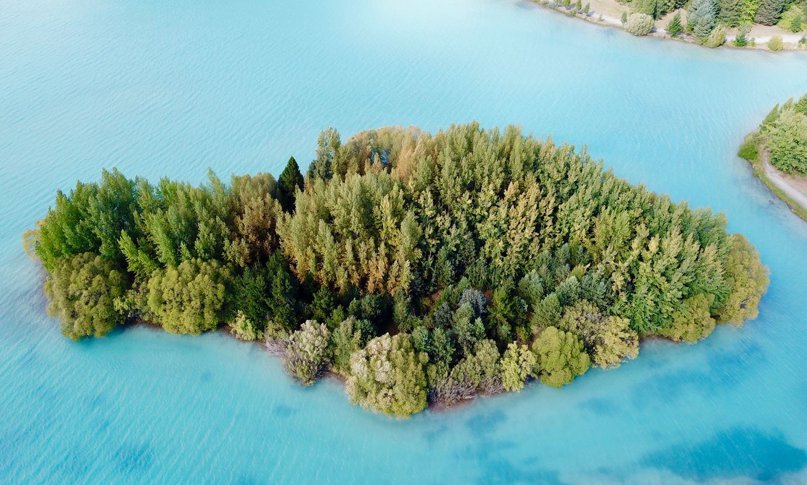

Lake Ruataniwha 是åè½åœ¨å°é•‡ Twizel æ—边的å°æ¹–，一座“鱼岛â€æ‚ é—²çš„躺在天è“色的湖中

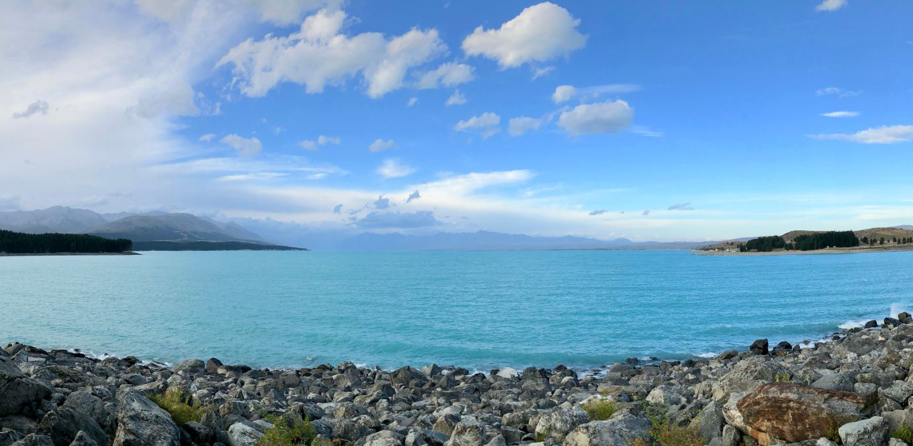

Lake Pukaki 则大的多，在湖的尽头是新西兰最高峰 — 库克山

除了纯净的湖水，åƒä¸‡å¹´æ¥çš„ä¸ä¸–éš”ç»ä¹Ÿç»™äº†è¿™é‡Œæœ€çº¯å‡€çš„天空。你å¯ä»¥åœ¨è¿™å—纯净的画布上用云彩æ’æˆä½ çˆ±çš„形状。例如问å·ï¼š

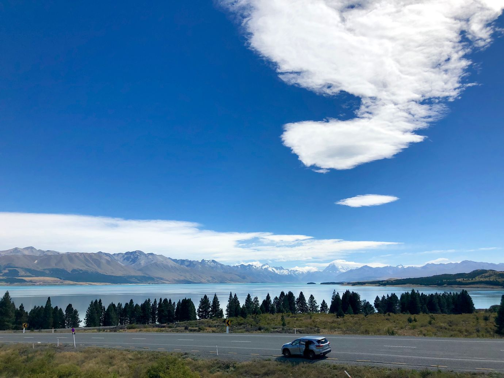

Lake Pukaki

还有感å¹å·ï¼š

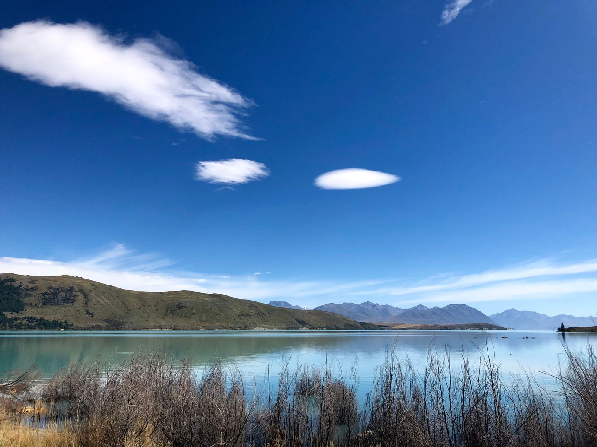

Lake Tekapo

当然，最纯净的画布最适åˆæŠ¹ä¸Šçš„一定是世界上最壮丽的画å·â€Šâ€” 银河：

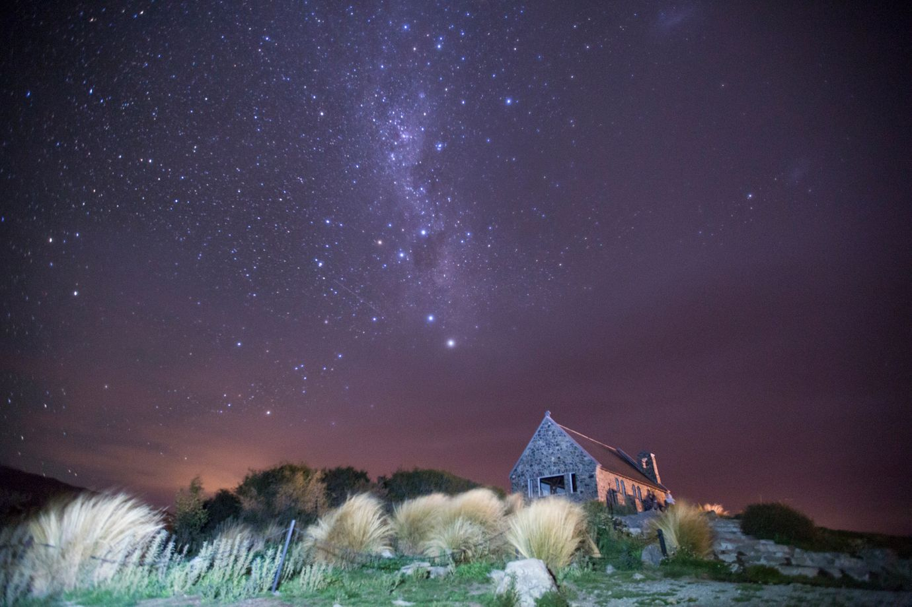

Starry Night in The Church of the Good Shepherd, Lake Tekapo — by LC

在喧闹的åŸå¸‚里生活的我们，å¯èƒ½å¾ˆå¤šå¹´éƒ½æ²¡æœ‰è§è¿‡æ¼«å¤©çš„ç¹æ˜Ÿã€‚但åªè¦æ›¾ç»äº²çœ¼è§è¿‡è¿™æ ·åˆ’破天际的绚丽星河的人们，我想一定ä¸ä¼šå¿˜è®°é‚£ä»½éœ‡æ’¼å´å®é™ã€çª’æ¯å´èˆ’心的情境。å³ä½¿å¤šå¹´ä»¥åä¾ç„¶é­‚牵梦è¦ï¼Œå¿ƒåº•æ€»æœ‰ä¸€ä»½å†²åŠ¨ï¼Œä¸ç•ä¸‡é‡Œä¹Ÿæƒ³å¯ç¨‹å‰å¾€ï¼Œå†æ¬¡è¿½å¯»ã€‚

到了西海岸的 Te Anau ，有ç€å¦ä¸€ç•ªé£æ™¯ã€‚这是一个无比é™è°§çš„å°é•‡ï¼Œåœ¨å¤œå¹•é™ä¸´å，宽阔的街é“上就几ä¹çœ‹ä¸è§äººå½±ï¼Œä¹Ÿæ²¡æœ‰è·¯ç¯ï¼Œåªæœ‰è¡—边房å­ç¨€ç–çš„ç¯ç«ã€‚

在这里的第一天ç»å†äº†ä¸€ä¸‹åˆçš„阴雨å，太阳快è½å±±æ—¶ç»ˆäºæœ‰ç‚¹æ”¾æ™´äº†ï¼Œåœ¨é™¢å­é‡Œæ”¾çœ¼æœ›å»ï¼Œå¤©ç©ºè¢«æ™šéœæŠ¹å¾—通红。当å³æ‹¿å‡º DJI èµ·é£ï¼Œç°åœ¨éƒ½è¿˜è®°å¾—æ‹å®Œå，å›æ”¾å›¾ä¼ çš„è§†é¢‘æ—¶ï¼Œæˆ‘ä¸€æ‹ LC 的大腿：“**的，è¦å‡ºå¤§ç‰‡ï¼â€ 😂

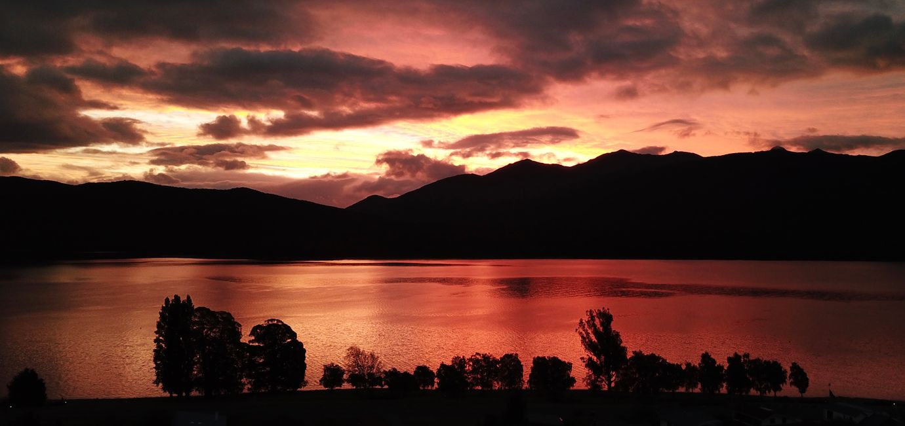

黄æ˜æ—¶åˆ†ï¼Œè¡€æŸ“çš„ Lake Te Anau

而到了皇å镇，作为新西兰的精ç¥æ ¸å¿ƒï¼Œä»è¹’跚学步的å°å­©ï¼Œåˆ°å¤´å‘花白的大爷大妈，ä»åœ°é¢åˆ°æ°´ä¸Šï¼Œå†åˆ°ç©ºä¸­ï¼Œæ€»æœ‰ä¸€æ¬¾é€‚åˆä½ çš„ç©ä¹ã€‚å³ä½¿æ˜¯å®‰å在岸边，åƒç€å†°æ·‡æ·‹ï¼Œçœ‹ç€æ¹–中央喷射快艇溅起的水花，或是被çªç„¶ä»æ¹–底窜出åšäº†ä¸€ä¸ªæµ·è±šå¼å空翻的“鲨鱼艇â€å“一跳，更别说还有近在咫尺的雪山，就这样é™é™çš„呆一下åˆä¹Ÿæ˜¯å€¼å¾—的。

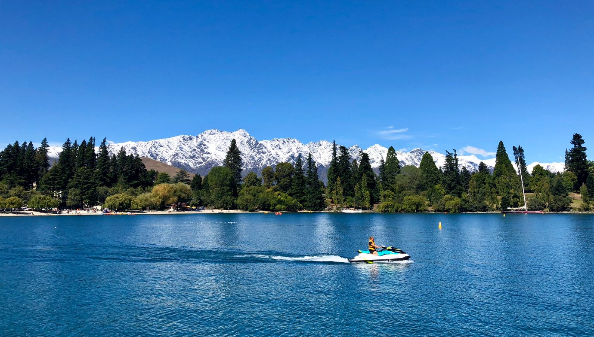

Queenstown

在享å—完一个安é™çš„下åˆå，是时候æ¥ä¸€åœºå¥‡å¹»çš„冒险了。作为æé™è¿åŠ¨çš„å‘æºåœ°ï¼Œè¿™é‡Œä½ é€šå¸¸å¯ä»¥èŠ±æœ€å°‘的钱，看最ç¾çš„é£æ™¯ï¼Œç©æœ€åˆºæ¿€çš„活动。

在离皇å镇ä¸è¿œçš„ Glenorchy，当å°é£æœºå‘¼å•¸ç€å¸¦ç€ä½ æ‹‰å‡åˆ° 15,000 英尺的空中，å†ç†¬è¿‡æ…¢æ…¢æŒªå‘舱门的那折磨人的一分钟ä¸åˆ°çš„时间å，æ¥ç€ä¸€ä¸ªä¿¯èº«ï¼Œåœ¨æ„Ÿå—了短暂的几秒钟真正的地心引力之å，终äºï¼Œä½ å¯ä»¥åœ¨ 200 km 时速的自由下å ä¸­ï¼Œä»å®¹åœ°æ¬£èµç¯ç»•åœ¨å››å‘¨ã€æœ›ä¸è§å°½å¤´çš„雪山，还有é™èººç€çš„æ·±è“色的 Lake Wakatipu。在这令人窒æ¯çš„é£æ™¯é¢å‰ï¼Œé…åˆè‚¾ä¸Šè…ºç´ çš„副作用，你甚至会想，就这样永远地下å ç€ä¹Ÿæœªå°ä¸å¯ã€‚

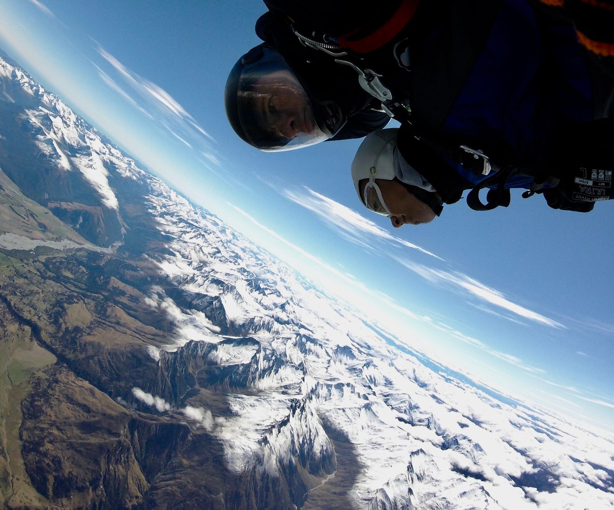

ä» 15,000 英尺的空中纵身一跃

挥洒一顿肾上腺素之å，在 Wanaka ç¨ä½œæ”¾æ¾ã€‚çˆ¬å‡ 1200m 登顶 Roy’s Peakï¼Œä¿¯ç° Wanaka æ¹–å’Œå°é•‡ï¼Œæ„Ÿå¹ç€é›ªå±±ã€é•œæ¹–ã€å°å²›å’Œå°é•‡çš„完ç¾èåˆã€‚

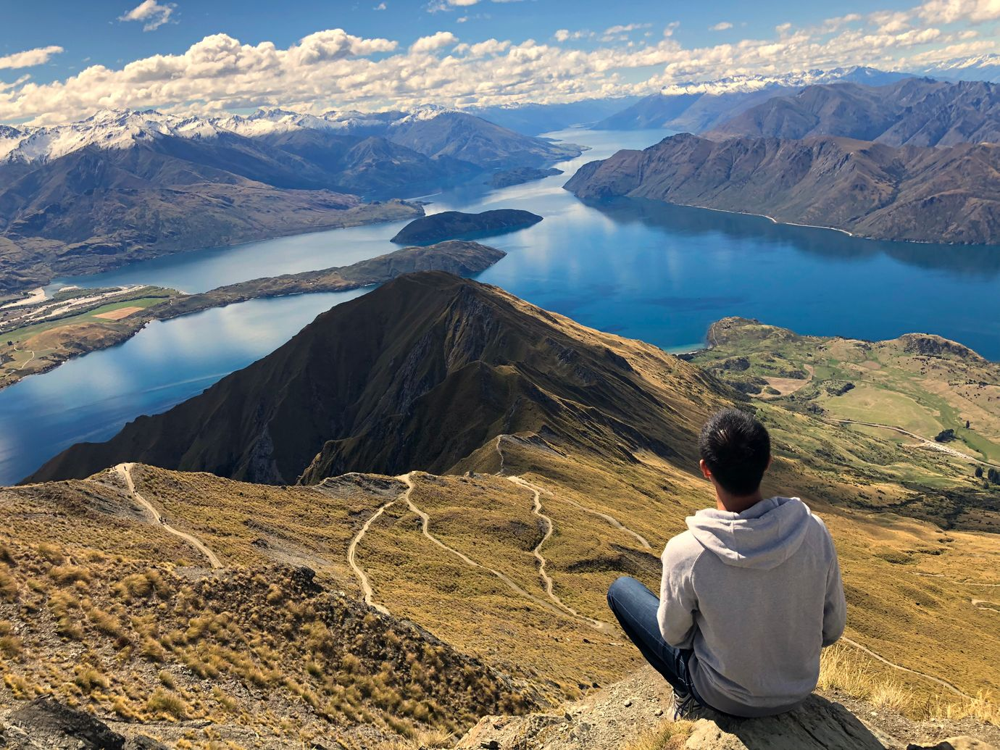

Roy's Peak

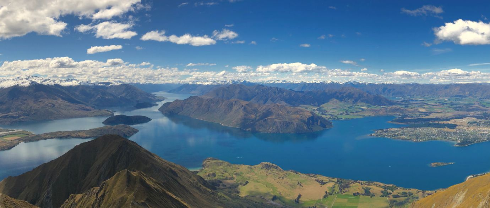

Afternoon at Roy’s Peak

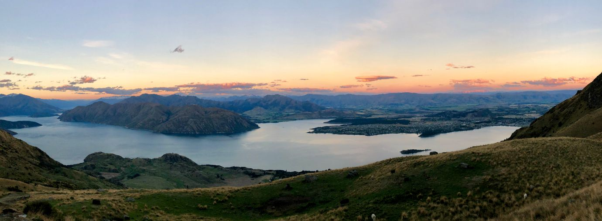

Twilight at Roy’s Peak

> 设想你家的å院有这样的é£æ™¯ä¼šæ˜¯æ€æ ·çš„体验？其å®è¿™åº§å±±å°±æ˜¯å½“地一个牧场主的ç§äººé¢†åœ°ï¼Œæˆ‘们走的这æ¡å…¬å…±æ­¥é“å…¶å®æ˜¯åœ¨ä»–家穿行，步é“边都是围æ ï¼Œå¶å°”还能看è§å‡ åªèµ°æ•£çš„绵羊。想起一部纪录片，一个新西兰的牧场主讲述自己家有 40,000 公顷土地，横跨几座山脉，如æœæ­¥è¡Œç©¿è¶Šå¯èƒ½éœ€è¦èµ°ä¸Šå¥½å‡ å¤©ã€‚知é“这些åä¸è§‰åˆæœ‰åŠ›æ°”起床æ¬ç –了。

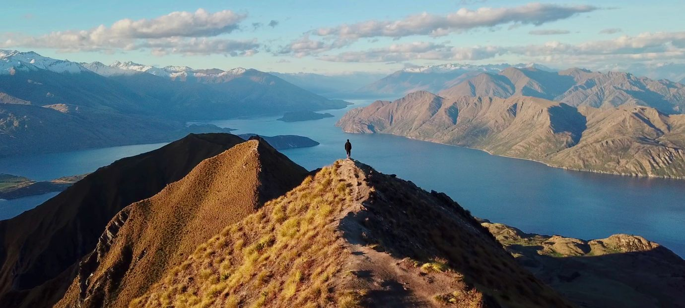

Man at Roy’s Peak

烧å了ä¸å°‘脑细èƒï¼Œæ†‹ä¸å‡ºæ›´å¤šæ–‡å­—了，下é¢æ”¾ä¸€äº›ç…§ç‰‡å’Œ[视频](https://www.skypixel.com/videos/dedf9b4f-da5a-4a04-9490-12d09d8211e5)。

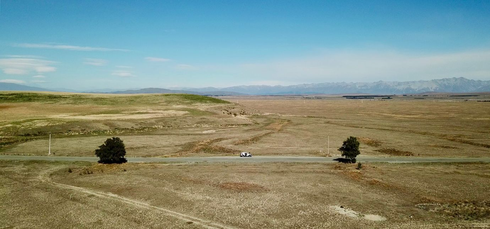

Fairlie Tekapo Road

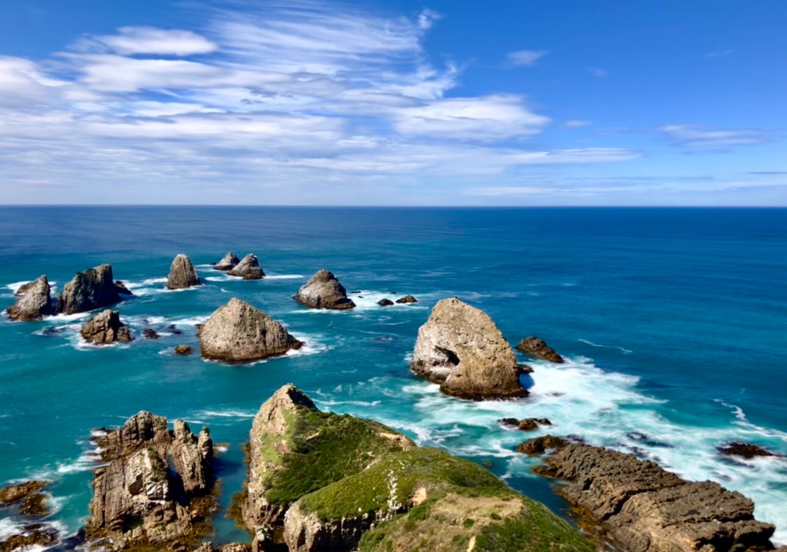

Nugget Point

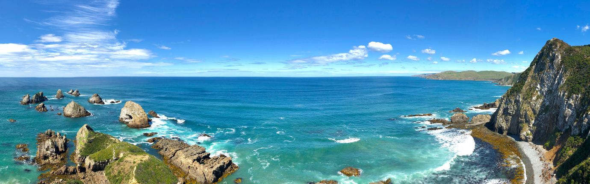

Nugget Point

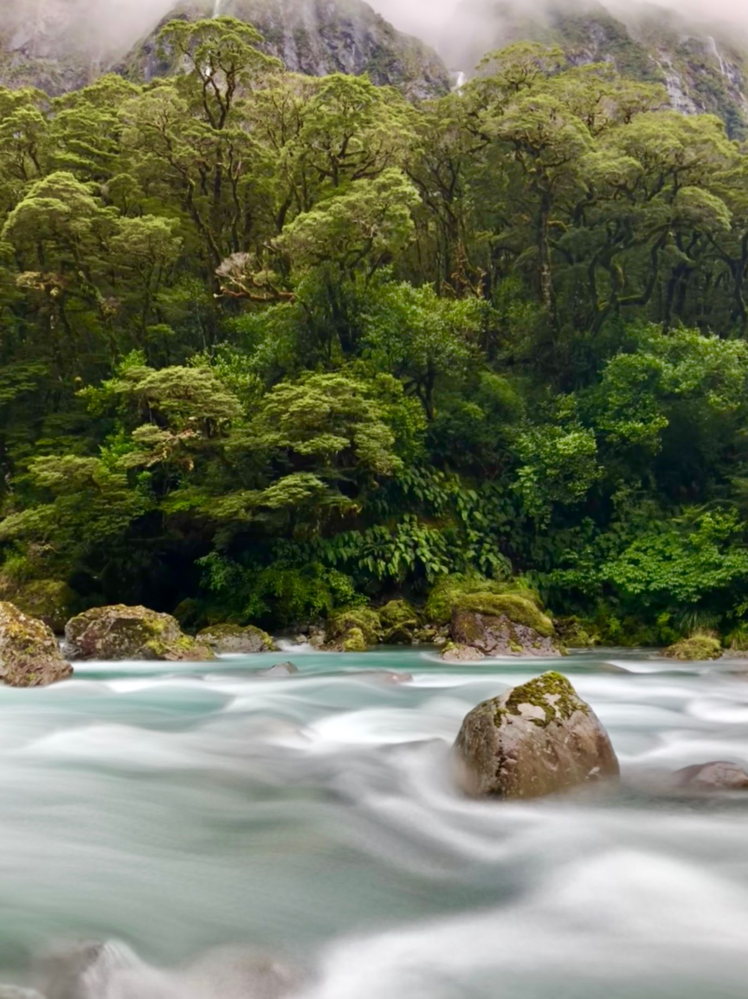

Milford Sound çš„åŸå§‹æ£®æ—和溪水

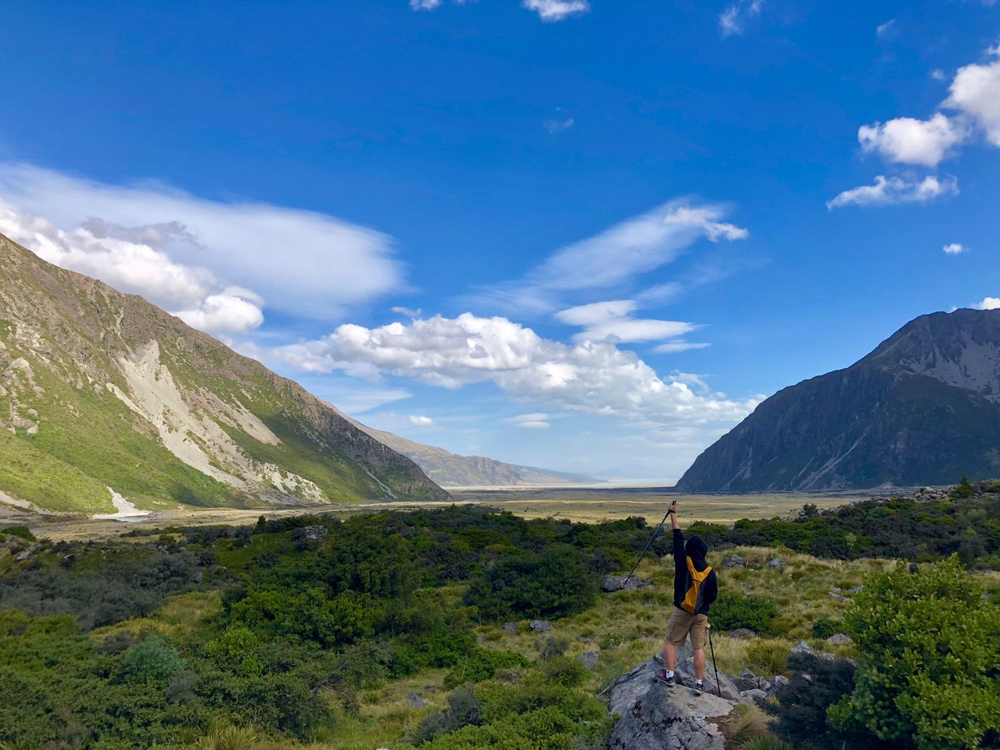

Hooker Valley

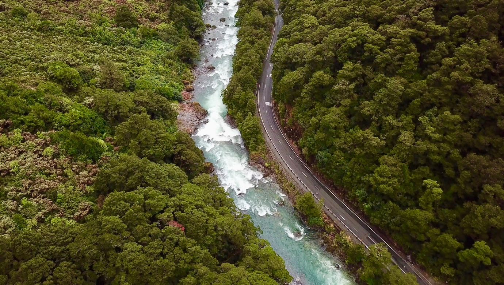

Milford Sound

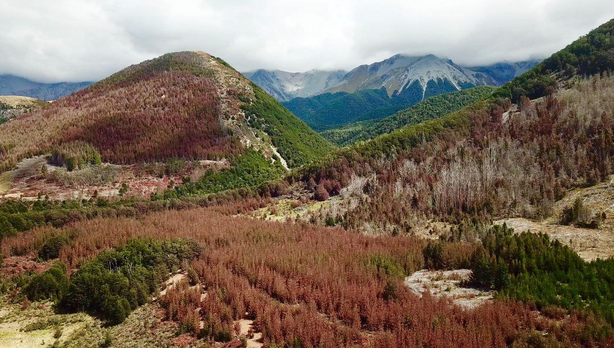

Arthur’s Pass National Park

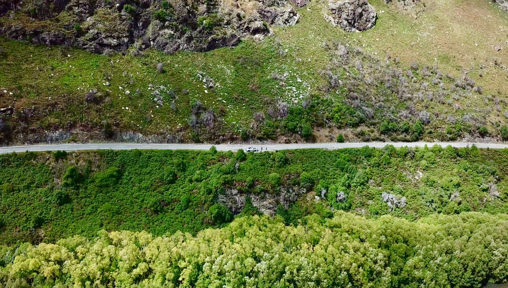

West Coast Road

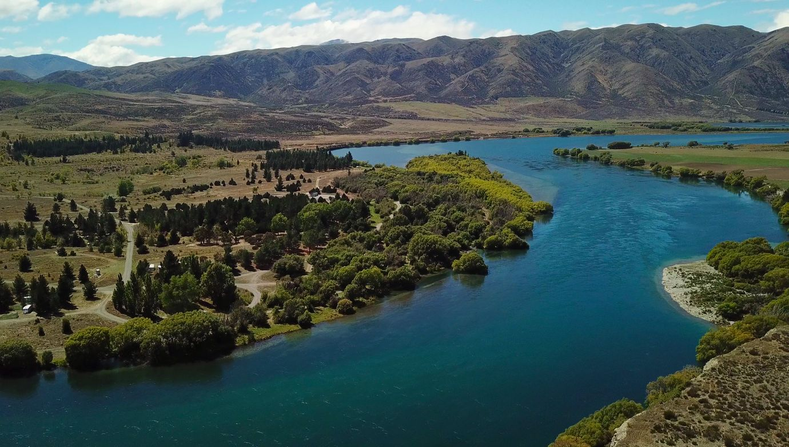

Waitaki River

